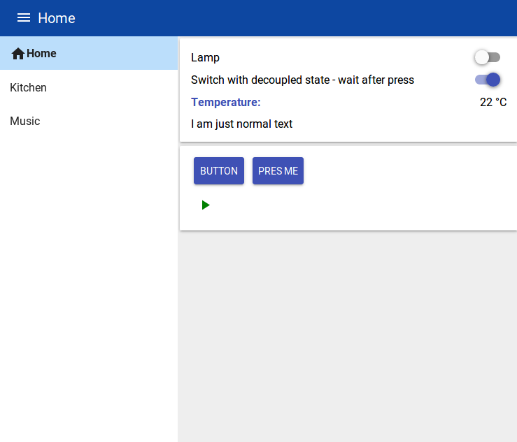

# Yet Another Node-Red Dashboard (yad)
A node-red dashboard based on web-components.

It allows you to create dashboard widgets as web-components that are accompanied by there own Node-RED node.

Building the dashboard then consists of plugging together html-tags, together with your favorite css. These widgets than automatically send and receive messages to/from Node-RED.



## Why another dashboard?
The standard dashboard for Node-RED [node-red-dashboard](https://flows.nodered.org/node/node-red-dashboard) is very convenient. You can create nice dashboards directly from Node-RED. However, this convenience also implies less flexibility, since for example everything has to fit into the predefined grid structure, you have to use angularjs. When I started this project, it was also not possible to create new widgets for node-red-dashboard (this has recently changed).
I needed more flexibility in creating my dashboards, for example to integrate a music browser/player into it.
Then I came across [node-red-contrib-uibuilder](https://github.com/TotallyInformation/node-red-contrib-uibuilder), which is somehow the complete opposite of node-red-dashboard. It gives you a lot of freedom in developing your dashboard and helps you to establish the connection to Node-RED. However, what I personally don't like is that all the communication goes to one single Node-RED node, not like with node-red-dashboard, where every widget has its own node.

Therefore, I created this dashboard, which is called node-red-contrib-component-dashboard, or in short **yad** for YetAnotherDashboard. This is somehow in between node-red-dashboard and node-red-contrib-uibuilder in the sense that you have the freedom of creating your dashboard as you want, but at the same time have the convenience that every widget on the dashboard has its own node in Node-RED.

## Note
This is a early proof of concept. Feedback/discussion appreciated.

# Installation
Go to your Node-RED user folder (e.g. ~/.node-red) and run
```
npm install --save node-red-contrib-component-dashboard
```

# Configuration
TL;DR: Just import `exampleFlow.json` into Node-RED for a quick start, run `node bundle` in `userDir/yad/dashboard`, where `userDir` is your Node-RED user directory. Then open `http://127.0.0.1:1880/dashboard`

Slightly longer version:
When you create a new yad-configuration node with a specific name, lets call it `dashboard`, a new folder in your Node-RED user directory (called `userDir` here) will be created `userDir/yad/dashboard`. There you can find `index.html, style.css, widgets.js, main.js`. With these files, you create your dashboard.

Everytime you changed a file in `userDir/yad/dashboard` or the first time you configured this dashboard, you need to run
```
node bundle
```
in `userDir/yad/dashboard`. This will run [parcel.js](https://parceljs.org/) to bundle your dashboard files. The first time it takes a little bit longer.
The `index.html` already contains an example dashboard. To use it with Node-RED, add an `yad paper button` node and give it the id `paperButton` (as in the html file).

To see the dashboard, goto `http://127.0.0.1:1880/dashboard`.

You can create as many independent dashboards as you want, just create a new yad configuration node with a new name.


# Information
* At the moment, all widgets are based on [polymer 3](https://polymer-library.polymer-project.org/). However, you can create your own widgets with any library for web-components or even native web-components.

* To create your own widgets, look at the existing ones. A guide will follow.
## Acknowledgements
This dashboard was inspired by
* [node-red-contrib-uibuilder](https://github.com/TotallyInformation/node-red-contrib-uibuilder) from TotallyInformation
* [node-red-dashboard](https://flows.nodered.org/node/node-red-dashboard) from the Node-RED team
* [node-red-contrib-polymer](https://www.npmjs.com/package/node-red-contrib-polymer) from hobbyquaker
